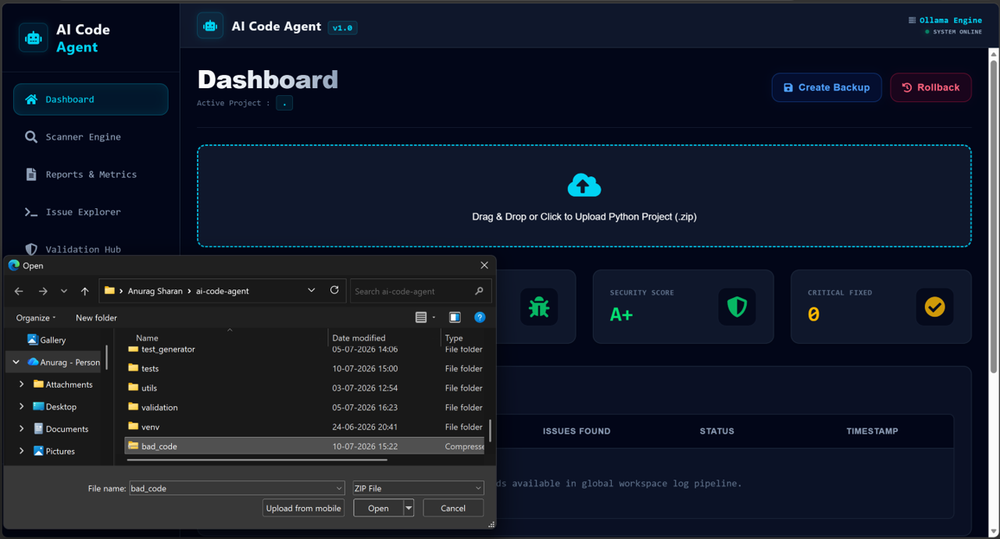
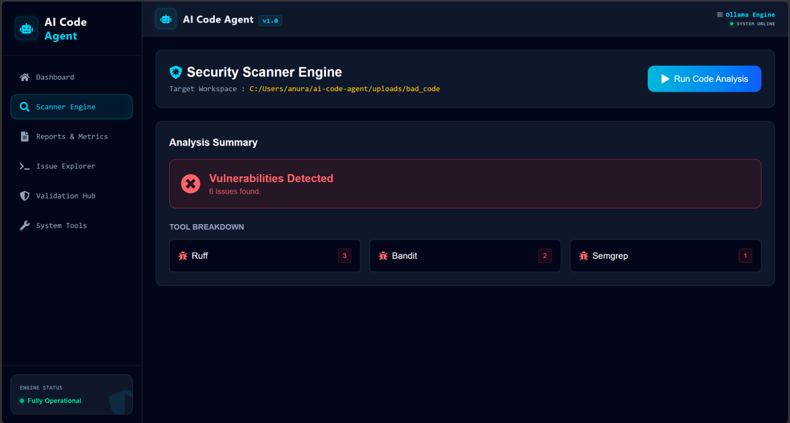
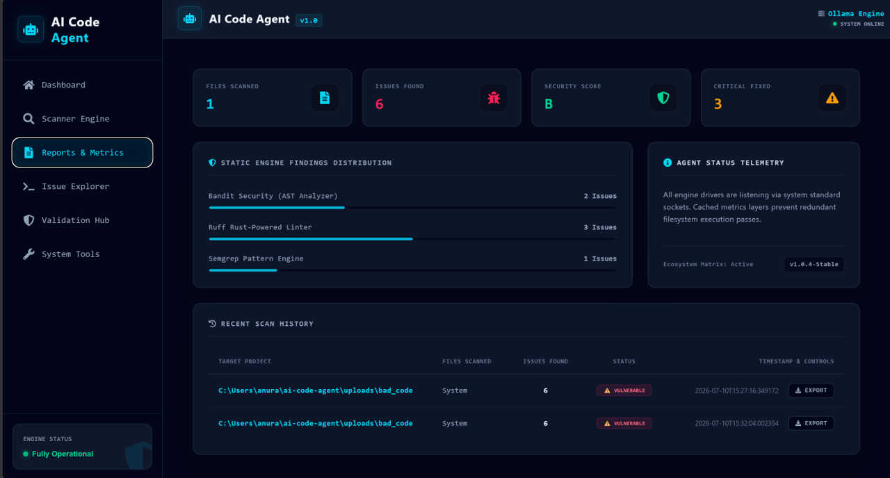
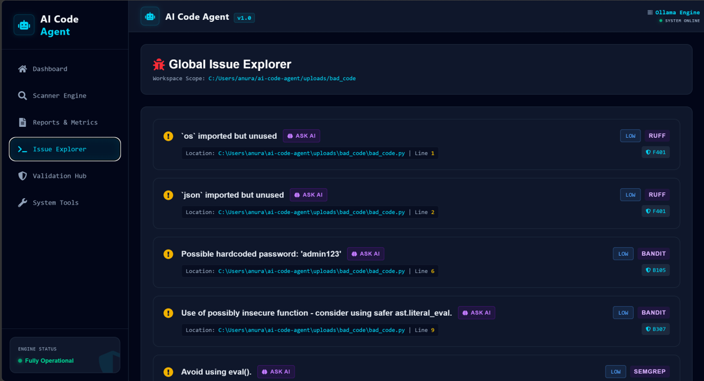
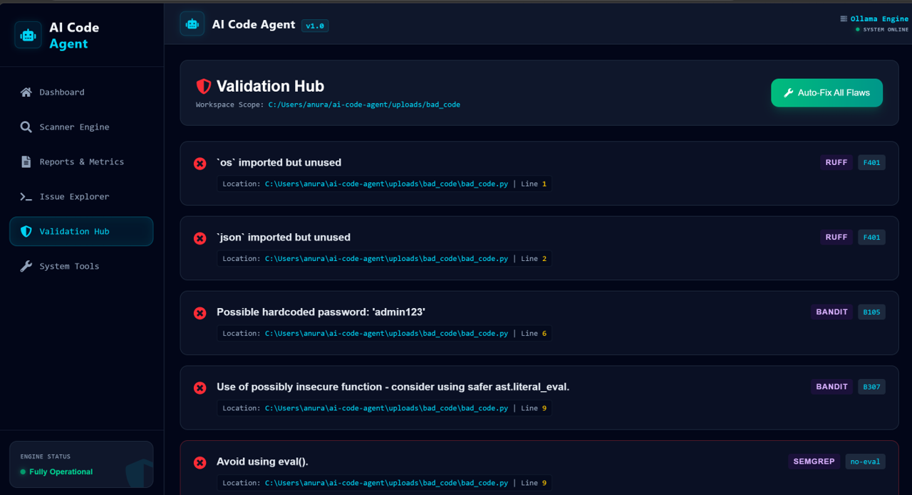
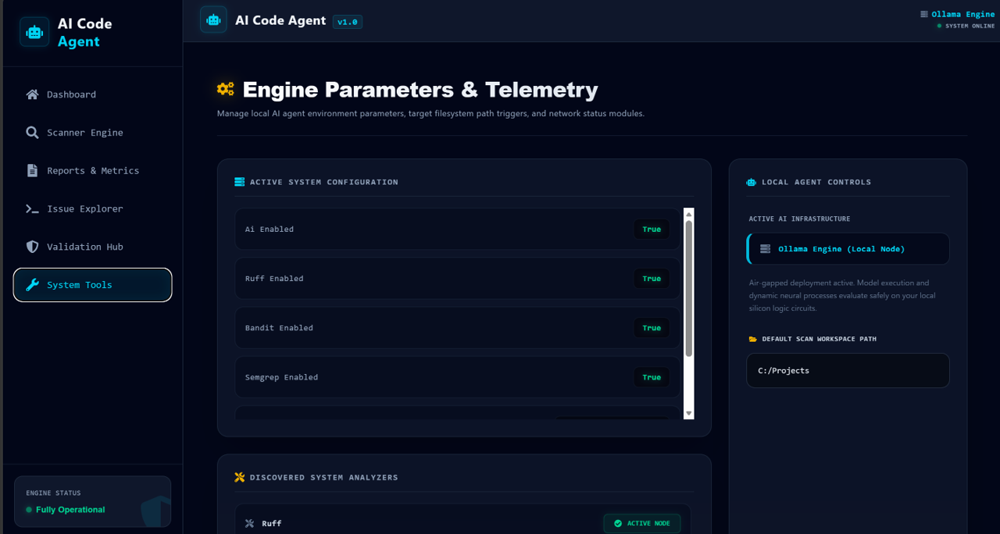
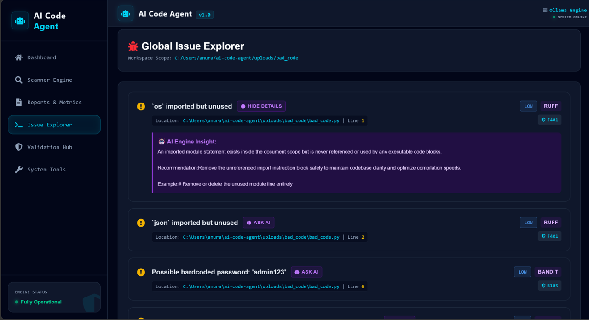
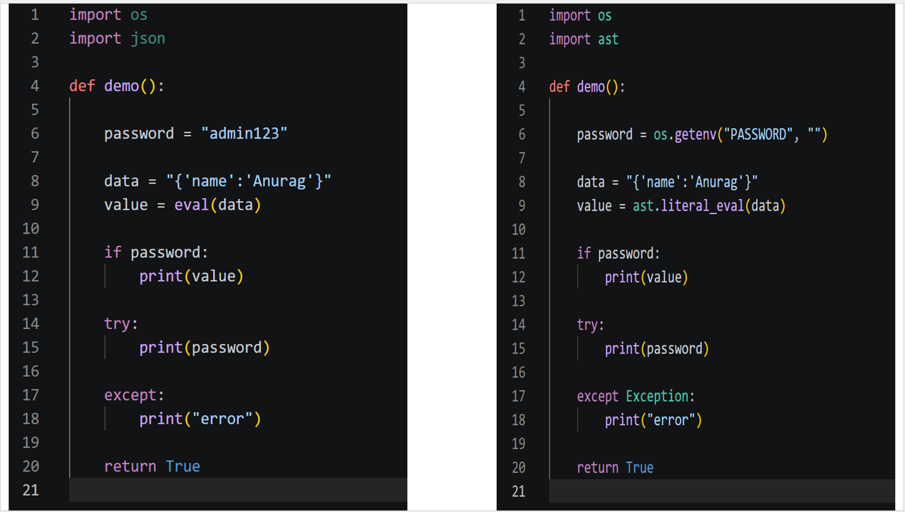

# 🤖 AI Code Agent

<div align="center">

### AI-Powered Secure Code Analysis, Vulnerability Detection & Intelligent Patch Generation Platform

An intelligent developer platform that combines **Static Analysis**, **AI-Powered Patch Generation**, and **Automated Security Validation** to streamline secure software development.

---


</div>

---

# 📖 Table of Contents

- [Overview](#-overview)
- [Features](#-features)
- [Frontend Dashboard](#-frontend-dashboard)
- [Architecture](#-architecture)
- [Technology Stack](#-technology-stack)
- [Project Structure](#-project-structure)
- [Installation](#-installation)
- [Running the Project](#-running-the-project)
- [API Endpoints](#-api-endpoints)
- [Security Workflow](#-security-workflow)
- [Screenshots](#-screenshots)
- [GitHub Actions](#-github-actions)
- [Roadmap](#-roadmap)
- [Contributing](#-contributing)
- [License](#-license)

---

# 🚀 Overview

AI Code Agent is an intelligent **code review**, **security analysis**, and **automated remediation platform** built using **FastAPI**, **React**, **LLMs**, and modern static analysis tools.

The platform helps developers automatically detect vulnerabilities, understand security findings, preview AI-generated fixes, validate patches, and safely apply code changes.

Unlike traditional static analyzers, AI Code Agent combines multiple security engines with Large Language Models to provide **context-aware explanations** and **intelligent code fixes**.

---

## 🎯 Objectives

- Detect security vulnerabilities automatically
- Generate AI-assisted code fixes
- Validate generated patches
- Reduce manual code review effort
- Improve developer productivity
- Integrate easily into CI/CD pipelines
- Provide an interactive web dashboard
- Support future multi-language code analysis

---

## ⭐ Key Highlights

- 🔍 Multi-engine Static Code Analysis
- 🤖 AI-powered Patch Generation
- 🛡 Built-in Patch Validation
- 📊 Interactive React Dashboard
- 📈 Project Metrics & Analytics
- 🧠 AI Explain Engine
- 🔄 Preview Before Apply
- ⚡ Automated Fix Pipeline
- 📂 Project-wide Code Indexing
- 📜 Rule Lookup API
- 📦 Git Backup & Restore Support
- 🚀 REST API Integration
- ⚙ GitHub Actions CI
- 📋 Scan History Tracking

---

> **AI Code Agent** bridges the gap between traditional static analysis tools and AI-assisted secure software development by providing an end-to-end automated security workflow.
# ✨ Features

## 🔍 Static Code Analysis

AI Code Agent combines multiple industry-standard static analysis tools to provide comprehensive project scanning.

### Supported Analysis Engines

- 🐍 **Bandit** – Python security vulnerability detection
- 🔎 **Semgrep** – Rule-based static code analysis
- ⚡ **Ruff** – Fast linting and code quality analysis

### Capabilities

- Full project scanning
- Incremental file scanning
- Security vulnerability detection
- Code quality checks
- Rule-based issue identification
- Severity classification
- Duplicate issue removal
- Unified scan report generation

---

# 🤖 AI-Powered Patch Generation

Unlike traditional scanners that only detect problems, AI Code Agent intelligently suggests fixes.

### Features

- Context-aware patch generation
- Prompt engineering for secure code
- Intelligent code modifications
- Multiple validation layers
- Safe patch generation
- Empty patch detection
- Oversized patch detection
- Syntax validation
- AI Explain functionality
- Preview before applying changes

---

# 🛡 Validation Engine

Every generated patch passes through multiple validation stages before being applied.

### Validation Checks

- Python syntax validation
- Empty patch detection
- Invalid diff detection
- Safe replacement verification
- Patch quality validation
- AI guardrails
- Duplicate modification prevention

---

# 📚 Context Engine

The Context Engine provides the LLM with sufficient project knowledge to generate accurate fixes.

### Features

- Project indexing
- Dependency graph generation
- Module discovery
- Import resolution
- File relationship mapping
- Context-aware prompt generation
- Intelligent source retrieval

---

# 📊 Dashboard & Analytics

The interactive React dashboard provides complete project insights in real time.

### Dashboard Widgets

- Security Score
- Files Scanned
- Issues Detected
- Active Analysis Engines
- Recent Scan History
- Top Triggered Rules
- Severity Distribution
- Deployment History

---

# 🖥 Frontend Dashboard

The web dashboard offers a modern interface for interacting with every stage of the analysis pipeline.

## 📈 Dashboard

- Live project statistics
- Dynamic metric cards
- Security score visualization
- Recent scans
- Rule analytics
- Deployment history

---

## 🔍 Scanner Engine

Features include:

- Project upload
- Scan progress
- Real-time status
- Engine selection
- Scan summary
- Scan history

---

## 📊 Reports & Metrics

Displays

- Overall scan results
- Severity breakdown
- Security score
- Rule distribution
- Tool statistics
- Historical metrics

---

## 🐞 Issue Explorer

Provides detailed issue inspection.

Each issue displays

- Severity
- Rule ID
- Analysis Tool
- File Path
- Line Number
- Issue Description
- Suggested Fix

Supports

- Severity filtering
- Tool filtering
- Rule badges
- Search functionality

---

## ✅ Validation Hub

Allows developers to validate generated fixes before applying them.

Features

- Preview Diff
- AI Explain
- Auto Fix
- Validation Status
- Patch Preview
- Before & After Comparison

---

## ⚙ System Tools

Displays system configuration and available analyzers.

Includes

- Enabled Tools
- Active Configuration
- Online Status
- AI Availability
- Max Iterations
- Semgrep Configuration
- Ruff Status
- Bandit Status

---

# ⚙ REST APIs

The platform exposes a comprehensive REST API for integration into external applications and CI/CD pipelines.

Current APIs include

- Project Scan
- Dashboard Summary
- Reports
- Configuration
- Tools
- Scan History
- Rule Lookup
- AI Explain
- Preview Diff
- Auto Fix
- Git Backup
- Rollback
- Health Check

---

# 🔒 Security Features

- AI Guardrails
- Patch Validation
- Secure Prompt Construction
- Context Isolation
- Rule Verification
- Safe Patch Application
- Backup Before Modification
- Rollback Support
- Validation Reports
- Intelligent Error Handling

---

# 🚀 Why AI Code Agent?

Unlike traditional static analysis tools, AI Code Agent doesn't stop at finding problems.

It enables developers to:

- Detect vulnerabilities
- Understand security findings
- Generate AI-assisted fixes
- Preview code changes
- Validate generated patches
- Apply fixes safely
- Track scan history
- Monitor project security through an interactive dashboard

This creates a complete end-to-end secure development workflow, significantly reducing manual effort while improving code quality and application security.
# 🏗 Architecture

The platform follows a modular architecture where each component is responsible for a dedicated stage of the analysis pipeline.

```text
                          ┌────────────────────────┐
                          │      React Frontend    │
                          │ Dashboard & Reports UI │
                          └────────────┬───────────┘
                                       │
                                REST API Calls
                                       │
                                       ▼
                    ┌──────────────────────────────────┐
                    │          FastAPI Backend          │
                    └──────────────┬────────────────────┘
                                   │
        ┌──────────────┬────────────┼──────────────┬──────────────┐
        ▼              ▼            ▼              ▼              ▼

   Project        Static        Context       Validation       AI Engine
   Indexing       Analysis       Engine         Engine

        │              │                             │
        ▼              ▼                             ▼

     Bandit       Semgrep                      Patch Validator
        │              │                             │
        └──────────────┴──────────────┐              │
                                      ▼              │
                               Issue Aggregator      │
                                      │              │
                                      ▼              ▼

                            AI Patch Generation Engine

                                      │
                                      ▼

                            Preview → Validate → Apply

                                      │
                                      ▼

                            Reports & Dashboard APIs
```

---

# ⚙ Analysis Workflow

The complete workflow consists of multiple stages designed to ensure reliable issue detection and safe patch generation.

```text
Project Upload
      │
      ▼

Project Indexing

      │
      ▼

Bandit Scan
      │
      ▼

Semgrep Scan
      │
      ▼

Ruff Analysis
      │
      ▼

Issue Aggregation
      │
      ▼

Severity Classification
      │
      ▼

Dashboard Report Generation
      │
      ▼

AI Patch Generation
      │
      ▼

Patch Validation
      │
      ▼

Preview Diff
      │
      ▼

Apply Fix
      │
      ▼

Git Backup
      │
      ▼

Final Report
```

---

# 🛠 Technology Stack

## Backend

| Technology | Purpose |
|------------|---------|
| Python 3.12+ | Core Programming Language |
| FastAPI | REST API Framework |
| Pydantic | Data Validation |
| Uvicorn | ASGI Server |
| AsyncIO | Concurrent Processing |

---

## Frontend

| Technology | Purpose |
|------------|---------|
| React | User Interface |
| React Router | Routing |
| Axios | API Communication |
| Tailwind CSS | Styling |
| Lucide React | Icons |

---

## AI Components

| Technology | Purpose |
|------------|---------|
| LangChain | LLM Orchestration |
| Ollama | Local LLM Runtime |
| Prompt Engineering | Context-Aware Patch Generation |
| AI Guardrails | Safe AI Responses |

---

## Security Analysis

| Tool | Purpose |
|------|---------|
| Bandit | Python Security Scanner |
| Semgrep | Static Analysis Engine |
| Ruff | Linter & Code Quality |

---

## Testing

- Pytest
- Ruff
- Bandit
- GitHub Actions

---

## Development Tools

- Git
- GitHub
- VS Code
- Virtual Environment
- REST APIs

---

# 📂 Project Structure

```text
ai-code-agent/
│
├── analyzers/
│   ├── bandit_runner.py
│   ├── semgrep_runner.py
│   └── ruff_runner.py
│
├── api/
│   ├── app.py
│   ├── models.py
│   ├── routes.py
│   └── services.py
│
├── config/
├── context_engine/
├── feedback/
├── git_automation/
├── llm/
├── logs/
├── parsers/
├── patch_engine/
├── project_index/
├── test_generator/
├── validation/
├── frontend/
│   ├── src/
│   ├── public/
│   └── package.json
│
├── tests/
├── uploads/
├── utils/
│
├── .github/
│   └── workflows/
│       └── ci.yml
│
├── requirements.txt
├── requirements-ci.txt
├── pipeline.py
├── app.py
└── README.md
```

---

# 🧩 Core Modules

## 🔍 Analysis Engine

Responsible for:

- Executing Bandit
- Running Semgrep
- Performing Ruff analysis
- Parsing tool outputs
- Merging scan results

---

## 🤖 AI Engine

Responsible for:

- Prompt construction
- Context retrieval
- Patch generation
- AI explanations
- Secure recommendations

---

## 🛡 Validation Engine

Responsible for:

- Patch validation
- Syntax verification
- Empty patch detection
- Diff validation
- Safe application checks

---

## 📊 Dashboard Module

Provides:

- Live metrics
- Reports
- Security score
- Scan history
- Tool status
- Rule analytics

---

## ⚙ Configuration Module

Handles

- Enabled analyzers
- AI configuration
- Runtime settings
- Validation options
- Scan preferences

---

# 📈 Scalability

The modular architecture allows future support for:

- Multi-language code analysis
- Additional security analyzers
- Cloud LLM providers
- Docker deployments
- Kubernetes clusters
- VS Code Extension
- GitHub App
- GitLab Integration
- Enterprise Authentication
- Team Collaboration
# ⚙ Installation

## Prerequisites

Before getting started, ensure the following tools are installed on your system:

- Python 3.12+
- Node.js 18+
- npm or yarn
- Git
- Ollama (for AI-powered patch generation)

---

# 📥 Clone the Repository

```bash
git clone https://github.com/AnuragS-2025/ai-code-agent.git
cd ai-code-agent
```

---

# 🐍 Backend Setup

## Create Virtual Environment

### Windows

```bash
python -m venv venv
venv\Scripts\activate
```

### Linux/macOS

```bash
python3 -m venv venv
source venv/bin/activate
```

---

## Install Backend Dependencies

```bash
pip install -r requirements.txt
```

---

## Install Development Dependencies

```bash
pip install -r requirements-ci.txt
```

---

# ⚛ Frontend Setup

Move into frontend directory

```bash
cd frontend
```

Install dependencies

```bash
npm install
```

or

```bash
yarn
```

---

# 🤖 Configure Ollama

Pull your preferred LLM.

Example:

```bash
ollama pull llama3
```

or

```bash
ollama pull mistral
```

Verify installation

```bash
ollama list
```

Start Ollama

```bash
ollama serve
```

---

# ▶ Running the Project

## Start Backend

From project root

```bash
uvicorn app:app --reload
```

Backend URL

```
http://localhost:8000
```

Swagger Documentation

```
http://localhost:8000/docs
```

ReDoc

```
http://localhost:8000/redoc
```

---

## Start Frontend

Open another terminal

```bash
cd frontend
npm run dev
```

Frontend URL

```
http://localhost:5173
```

---

# 🚀 Quick Start

### Step 1

Start Ollama

```bash
ollama serve
```

### Step 2

Run Backend

```bash
uvicorn app:app --reload
```

### Step 3

Run Frontend

```bash
cd frontend
npm run dev
```

### Step 4

Open Dashboard

```
http://localhost:5173
```

Upload a project and begin scanning.

---

# 📡 REST API Endpoints

## Health Check

```http
GET /health
```

Returns

- API Status
- Version
- Service Health

---

## Scan Project

```http
POST /scan
```

Scans an uploaded project using all enabled analyzers.

Response includes

- Files scanned
- Total issues
- Security score
- Generated report

---

## Dashboard Summary

```http
GET /dashboard
```

Returns

- Files scanned
- Issues found
- Security score
- Top rules
- Scan history

---

## Reports

```http
GET /report
```

Returns the latest scan report.

---

## Scan History

```http
GET /history
```

Displays

- Previous scans
- Scan timestamps
- Issue counts

---

## Configuration

```http
GET /config
```

Returns

- AI Enabled
- Ruff Enabled
- Bandit Enabled
- Semgrep Enabled
- Maximum Iterations
- Semgrep Configuration

---

## Enabled Tools

```http
GET /tools
```

Example Response

```json
{
  "tools": [
    {
      "name": "Ruff",
      "enabled": true
    },
    {
      "name": "Bandit",
      "enabled": true
    },
    {
      "name": "Semgrep",
      "enabled": true
    }
  ]
}
```

---

## Rule Lookup

```http
GET /rules/{rule_id}
```

Example

```
GET /rules/B602
```

Returns

- Rule ID
- Description
- Severity
- Recommendation

---

## AI Explain

```http
POST /explain
```

Request

```json
{
  "rule": "B602",
  "message": "subprocess call with shell=True",
  "file": "app.py",
  "line": 42
}
```

Provides an AI-generated explanation along with secure remediation guidance.

---

## Preview Diff

```http
POST /diff
```

Returns a preview of the proposed code changes before applying a patch.

---

## Auto Fix

```http
POST /fix
```

Generates and validates AI-assisted patches for detected issues.

---

## Git Backup

```http
POST /git/backup
```

Creates a backup before modifying project files.

---

## Rollback

```http
POST /git/rollback
```

Restores the previous project state if required.

---

# 📋 Typical Workflow

```text
Upload Project
        │
        ▼

Run Static Analysis
        │
        ▼

Review Dashboard
        │
        ▼

Explore Issues
        │
        ▼

Open Validation Hub
        │
        ▼

Preview Diff
        │
        ▼

Ask AI
        │
        ▼

Apply Auto Fix
        │
        ▼

Generate Reports
```

---

# 💡 Supported Analysis Tools

| Tool | Purpose |
|------|---------|
| Ruff | Code Quality & Linting |
| Bandit | Python Security Analysis |
| Semgrep | Static Code Analysis |
| Ollama | Local LLM Runtime |
| LangChain | AI Prompt Orchestration |

The modular architecture allows additional analyzers and LLM providers to be integrated with minimal changes.
# 📸 Screenshots

> **Note:** Save your screenshots inside `docs/images/` with the filenames shown below. The images will automatically render on GitHub.

---

# 📊 Dashboard

The Dashboard provides a real-time overview of project health, security metrics, scan statistics, and analyzer activity.

### Features

- Dynamic Security Score
- Files Scanned
- Issues Detected
- Top Triggered Rules
- Recent Scan History
- Deployment Artifact History
- Live Backend Metrics

<p align="center">

</p>

---

# 🔍 Scanner Engine

The Scanner Engine allows developers to upload projects and perform comprehensive static analysis.

### Features

- Project Upload
- One-click Scan
- Real-time Scan Progress
- Multi-engine Analysis
- Scan Status
- Scan Summary

<p align="center">

</p>

---

# 📈 Reports & Metrics

Provides detailed project analysis and historical insights.

### Includes

- Total Issues
- Severity Distribution
- Security Score
- Rule Analytics
- Tool Statistics
- Scan Metrics
- Historical Reports

<p align="center">

</p>

---

# 🐞 Issue Explorer

A centralized page for inspecting every issue detected during project analysis.

Each issue displays:

- Severity
- Rule ID
- Tool Name
- File Path
- Line Number
- Description

Filtering options include:

- Severity
- Tool
- Rule

<p align="center">

</p>

---

# ✅ Validation Hub

The Validation Hub enables developers to inspect AI-generated fixes before applying them.

### Features

- Preview Diff
- Ask AI
- Auto Fix
- Validation Status
- Rule Information
- File Details
- Before/After Comparison

<p align="center">

</p>

---

# ⚙ System Tools

Displays runtime configuration and analyzer status.

Shows

- AI Enabled
- Ruff Status
- Bandit Status
- Semgrep Status
- Maximum Iterations
- Configuration Details
- Online Status

<p align="center">

</p>

---

# 🤖 AI Explain

AI Explain provides context-aware explanations for detected vulnerabilities.

Capabilities

- Vulnerability Explanation
- Root Cause Analysis
- Security Recommendation
- Best Practices
- Suggested Remediation

<p align="center">

</p>

---

# 🩹 Auto Fix

Automatically generates and applies validated AI-assisted code patches.

Pipeline

```text
Issue Detection
        │
        ▼

Patch Generation
        │
        ▼

Validation
        │
        ▼

Preview
        │
        ▼

Apply Fix
        │
        ▼

Update Reports
```

<p align="center">

</p>

---

# 🎯 Complete Application Workflow

```text
Developer

    │

    ▼

Upload Project

    │

    ▼

Project Scan

    │

    ▼

Bandit + Semgrep + Ruff

    │

    ▼

Issue Aggregation

    │

    ▼

Dashboard

    │

    ▼

Issue Explorer

    │

    ▼

Validation Hub

    │

    ▼

AI Explain

    │

    ▼

Preview Diff

    │

    ▼

Auto Fix

    │

    ▼

Git Backup

    │

    ▼

Updated Report

    │

    ▼

Secure Project
```

---

# 🌟 Highlights

✅ Modern React Dashboard

✅ AI-Assisted Code Review

✅ Multi-Engine Security Analysis

✅ Intelligent Patch Generation

✅ Interactive Issue Explorer

✅ Validation Before Apply

✅ Secure Patch Workflow

✅ Automated Reports

✅ REST API Integration

✅ GitHub Actions CI

✅ Modular Architecture

✅ Developer-Friendly User Experience
# 🧪 Testing

AI Code Agent includes automated testing utilities to ensure reliability and maintain code quality.

## Run All Tests

```bash
python -m pytest
```

---

## Run a Specific Test

```bash
python -m pytest tests/test_llm.py
```

---

## Generate Coverage Report

```bash
pytest --cov=. --cov-report=html
```

---

# 🔒 Security Scanning

The project integrates multiple security analysis tools.

## Ruff

```bash
ruff check .
```

---

## Bandit

Scan the entire project

```bash
bandit -r .
```

Scan a specific file

```bash
bandit app.py
```

---

## Semgrep

```bash
semgrep --config auto .
```

---

# 🛡 Security Workflow

The platform follows a secure multi-stage workflow before applying any AI-generated code changes.

```text
Project Upload

      │

      ▼

Static Analysis

      │

      ▼

Issue Detection

      │

      ▼

Context Collection

      │

      ▼

AI Patch Generation

      │

      ▼

Syntax Validation

      │

      ▼

Patch Verification

      │

      ▼

Preview Diff

      │

      ▼

Developer Approval

      │

      ▼

Apply Patch

      │

      ▼

Git Backup

      │

      ▼

Final Report
```

---

# ⚡ GitHub Actions CI

Every Pull Request automatically executes the CI pipeline.

## Included Checks

- Ruff Linting
- Bandit Security Scan
- Semgrep Analysis
- Unit Testing
- Build Verification

### Workflow

```text
Push / Pull Request

        │

        ▼

GitHub Actions

        │

        ▼

Install Dependencies

        │

        ▼

Run Ruff

        │

        ▼

Run Bandit

        │

        ▼

Run Semgrep

        │

        ▼

Run Pytest

        │

        ▼

CI Result
```

Workflow file

```text
.github/workflows/ci.yml
```

---

# 🚀 Roadmap

## ✅ Completed

- FastAPI Backend
- React Dashboard
- Static Code Analysis
- Bandit Integration
- Semgrep Integration
- Ruff Integration
- Context Engine
- AI Patch Generation
- Validation Engine
- Issue Explorer
- Reports & Analytics
- Dashboard API
- Configuration API
- Tools API
- Rule Search API
- Scan History
- Preview Diff
- Auto Fix API
- Git Backup
- GitHub Actions CI
- HTML Report Export
- Docker Support


# 🤝 Contributing

Contributions are welcome!

1. Fork this repository

2. Create a new branch

```bash
git checkout -b feature/my-feature
```

3. Commit your changes

```bash
git commit -m "Add awesome feature"
```

4. Push your branch

```bash
git push origin feature/my-feature
```

5. Open a Pull Request 🚀

Please ensure that:

- Code is formatted
- Tests pass successfully
- Documentation is updated
- Security checks are completed

---

# 📜 License

This project is licensed under the **MIT License**.

Feel free to use, modify, and distribute this software in accordance with the license terms.

---

# 👨‍💻 Author

## Anurag Sharan

AI & Full Stack Developer

### Connect with me

- GitHub: https://github.com/AnuragS-2025
- Email: as9771@srmist.edu.in

---

# 💙 Acknowledgements

Special thanks to the open-source community and the amazing projects that made AI Code Agent possible.

- FastAPI
- React
- LangChain
- Ollama
- Bandit
- Semgrep
- Ruff
- Pytest
- GitHub Actions

---

# ⭐ Support

If you found this project helpful,

⭐ Star this repository

🐛 Report Issues

💡 Suggest Features

🤝 Contribute to the Project

---

<div align="center">

## 🚀 AI Code Agent

### Secure Code. Intelligent Fixes. Faster Development.

Made with ❤️ using FastAPI, React, LangChain & Open Source.

**Happy Coding! 🎉**

</div>